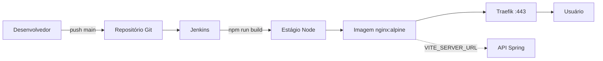

# PW45S — Cliente React (deploy)

Aplicação **React 19** + **TypeScript** + **Vite** servida por **Nginx** em container Docker. O build de produção embute a URL da API; o tráfego público passa pelo **Traefik** (HTTPS). O deploy automatizado é feito pelo **Jenkins**, no mesmo servidor onde rodam Traefik, PostgreSQL (API) e demais serviços de [`../server-config/`](../server-config/).

## Visão geral do fluxo



1. Push na branch `main` dispara o pipeline (webhook ou polling).
2. **Docker build** — estágio Node compila o Vite; estágio Nginx serve os arquivos estáticos em `/usr/share/nginx/html`.
3. **Docker Compose** sobe o container `pw45s-client` na rede `web`.
4. O **Traefik** roteia `https://<dominio>` para a porta 80 do container.

A API (`server/`) é deployada separadamente; o cliente consome `VITE_SERVER_URL` configurada no momento do build.

## Arquivos envolvidos no deploy

| Arquivo | Função |
|---------|--------|
| [`Dockerfile`](Dockerfile) | Build multi-stage: Node 18 → `npm run build`; Nginx Alpine serve `dist/` |
| [`docker-compose.yml`](docker-compose.yml) | Serviço `pw45s-client`, labels Traefik e rede `web` |
| [`Jenkinsfile`](Jenkinsfile) | `docker build` + `docker compose up -d` |
| [`.env.production`](.env.production) | `VITE_SERVER_URL` usada no build de produção |
| [`.env.development`](.env.development) | URL da API em desenvolvimento local |
| [`vite.config.ts`](vite.config.ts) | Configuração Vite (alias `@` → `src`) |
| [`package.json`](package.json) | Script `build`: `tsc -b && vite build` |
| [`src/lib/axios.ts`](src/lib/axios.ts) | Cliente HTTP com `import.meta.env.VITE_SERVER_URL` |

## Dockerfile

Build em duas etapas:

1. **`node:18.15.0-alpine`** — `npm install`, copia o projeto, `npm run build` (saída em `dist/`).
2. **`nginx:stable-alpine`** — copia `dist/` para `/usr/share/nginx/html`, expõe porta **80** internamente.

> As variáveis `VITE_*` são resolvidas **no build**. Para alterar a URL da API em produção, é necessário **rebuildar** a imagem com `.env.production` correto (o pipeline Jenkins faz isso a cada deploy).

## Variáveis de ambiente (Vite)

| Arquivo | Variável | Exemplo |
|---------|----------|---------|
| `.env.development` | `VITE_SERVER_URL` | `http://localhost:8080` |
| `.env.production` | `VITE_SERVER_URL` | `https://api.viniciuspegorini.com.br` |

Uso no código:

```typescript
// src/lib/axios.ts
baseURL: import.meta.env.VITE_SERVER_URL
```

Antes do deploy, ajuste `.env.production` para o subdomínio real da API (o mesmo host configurado no Traefik para `pw45s-server`).

## docker-compose.yml

| Configuração | Valor |
|--------------|-------|
| Imagem | `react-app:latest` (tag gerada no Jenkins) |
| Container | `pw45s-client` |
| Porta host | `8100:80` (acesso direto opcional) |
| Rede | `web` (externa, compartilhada com Traefik) |

### Labels Traefik

```yaml
traefik.http.routers.pw45s-client.rule=Host(`viniciuspegorini.com.br`)
traefik.http.routers.pw45s-client.entrypoints=websecure
traefik.http.routers.pw45s-client.tls.certresolver=letsencrypt
traefik.http.services.pw45s-client.loadbalancer.server.port=80
```

Substitua o `Host` pelo domínio raiz do frontend. O Traefik em `server-config` emite o certificado Let's Encrypt e redireciona HTTP → HTTPS.

## Pipeline Jenkins

Pré-requisitos (no servidor):

1. Stack [`../server-config/`](../server-config/) em execução (Traefik, Jenkins, etc.).
2. Rede Docker externa: `docker network create --driver=bridge --attachable web`

Criar job **Client** no Jenkins:

| Campo | Valor |
|-------|--------|
| Tipo | Pipeline |
| SCM | Git |
| Repositório | Este código ou [pw45s-client-deploy](https://github.com/viniciuspegorini/pw45s-client-deploy) |
| Branch | `*/main` |
| Script | `Jenkinsfile` do repositório |

Estágios do [`Jenkinsfile`](Jenkinsfile):

1. **Docker Build** — `docker build -t react-app:latest .`
2. **Docker Compose UP** — `docker compose up -d`

O Jenkins utiliza o Docker do host (socket montado no container Jenkins da infraestrutura).

### Deploy manual

```bash
# conferir .env.production
docker build -t react-app:latest .
docker compose up -d
```

Acesse via Traefik: `https://<seu-dominio>` ou diretamente: `http://<IP>:8100`.

## Relação com API, PostgreSQL e Traefik

| Serviço | Papel no cliente |
|---------|------------------|
| **Traefik** | Termina TLS e roteia o domínio do frontend para o container Nginx |
| **API Spring** | Backend REST; URL definida em `VITE_SERVER_URL` (não passa pelo Traefik do cliente) |
| **PostgreSQL** | Usado apenas pela API; o cliente não conecta ao banco |
| **Jenkins** | Automatiza build e publicação da imagem `react-app:latest` |

Ordem sugerida no primeiro deploy:

1. Infraestrutura (`server-config`)
2. Banco `pw45s` + deploy da **API** (`server/`)
3. Ajustar `.env.production` com a URL pública da API
4. Deploy do **cliente** (este projeto)

## Desenvolvimento local

```bash
npm install
npm run dev
```

Com a API em `http://localhost:8080`, use `.env.development`. O Vite sobe em `http://localhost:5173` (porta padrão).

## Checklist pós-deploy

- [ ] `.env.production` com `VITE_SERVER_URL` da API em HTTPS
- [ ] Imagem `react-app:latest` buildada após qualquer mudança de URL
- [ ] Container `pw45s-client` na rede `web`
- [ ] DNS do domínio raiz apontando para o Droplet (Cloudflare)
- [ ] `https://<dominio>` carrega o SPA e as chamadas vão para a API

## Referências

- [Vite — Env variables](https://vitejs.dev/guide/env-and-mode.html)
- [React — Documentação](https://react.dev/)
- [Nginx — Docker image](https://hub.docker.com/_/nginx)
- [Traefik — HTTP routers](https://doc.traefik.io/traefik/routing/routers/)
- [Jenkins — Pipeline](https://www.jenkins.io/doc/book/pipeline/)
- API e banco: [`../server/README.md`](../server/README.md)
- Infraestrutura: [`../server-config/Readme.MD`](../server-config/Readme.MD)
- Repositório de deploy (referência): [pw45s-client-deploy](https://github.com/viniciuspegorini/pw45s-client-deploy)
