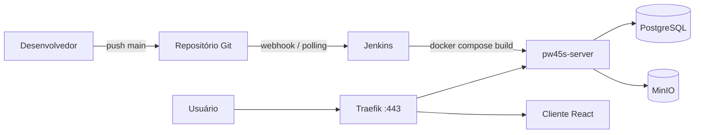

# PW45S — API Spring Boot (deploy)

API REST em **Spring Boot 4** / **Java 25** que persiste dados no **PostgreSQL**, armazena arquivos no **MinIO** e é publicada em produção via **Jenkins**, atrás do **Traefik** (HTTPS e roteamento por subdomínio).

A infraestrutura base (Traefik, Jenkins, PostgreSQL, MinIO, pgAdmin) é provisionada na pasta [`../server-config/`](../server-config/). Este documento descreve o deploy **desta aplicação** e como ela se integra a esses serviços.

## Visão geral do fluxo



1. O código é versionado no Git (repositório de deploy ou este monorepo).
2. O **Jenkins** executa o `Jenkinsfile`: `docker compose up -d --build`.
3. O **Dockerfile** compila o JAR com Maven e gera a imagem de runtime.
4. O container `pw45s-server` entra na rede Docker `web` e `database`.
5. O **Traefik** descobre o serviço pelos labels e expõe `https://api.<seu-dominio>`.

## Arquivos envolvidos no deploy

| Arquivo | Função |
|---------|--------|
| [`Dockerfile`](Dockerfile) | Build multi-stage: compila com `eclipse-temurin:25-jdk-alpine` e executa o JAR na imagem final |
| [`docker-compose.yml`](docker-compose.yml) | Define o serviço `api`, variáveis de ambiente e labels do Traefik |
| [`Jenkinsfile`](Jenkinsfile) | Pipeline CI/CD: credenciais do Jenkins + `docker compose up -d --build` |
| [`.env-example`](.env-example) | Modelo de variáveis para desenvolvimento local |
| [`src/main/resources/application.yaml`](src/main/resources/application.yaml) | Perfis Spring (`dev`, `prod`, `test`), datasource e MinIO |
| [`pom.xml`](pom.xml) | Artefato Maven `server-0.1.jar` (copiado no estágio final do Docker) |

## Dockerfile

O build ocorre em duas etapas:

1. **Build** — copia `mvnw`, `pom.xml` e `src/`, normaliza line endings do wrapper e executa `mvnw package -DskipTests`.
2. **Delivery** — copia `target/server-0.1.jar` para `server.jar` e inicia com `java -jar server.jar`.

```dockerfile
# Estágio 1: eclipse-temurin:25-jdk-alpine → mvnw package
# Estágio 2: imagem JRE/JDK 25 → java -jar server.jar
```

## docker-compose.yml

O serviço `api` publica a aplicação e conecta-se à infraestrutura já em execução:

| Configuração | Valor |
|--------------|-------|
| Imagem / build | `pw45s-server` (build local via `Dockerfile`) |
| Container | `pw45s-server` |
| Porta | `8080:8080` |
| Redes | `web` (externa, Traefik) e `database` (PostgreSQL) |

### Labels Traefik

O Traefik (em `server-config`) roteia tráfego HTTPS com base nos labels:

```yaml
traefik.http.routers.pw45s-server.rule=Host(`api.viniciuspegorini.com.br`)
traefik.http.routers.pw45s-server.entrypoints=websecure
traefik.http.routers.pw45s-server.tls.certresolver=letsencrypt
```

Substitua o host pelo subdomínio da API no seu domínio. O registro DNS tipo **A** deve apontar para o IP do Droplet; o certificado TLS é emitido pelo Let's Encrypt (desafio DNS via Cloudflare, configurado no Traefik).

## PostgreSQL

O perfil **`prod`** em `application.yaml` usa:

- URL: `${DATABASE_URL}` (JDBC)
- Usuário/senha: `${DATABASE_USERNAME}` / `${DATABASE_PASSWORD}`
- Migrações: Flyway em `classpath:/db/prod`

### Criar o banco (primeira vez)

Com o stack `server-config` em execução:

```bash
docker exec -it postgresql psql -U postgres -c "CREATE DATABASE pw45s;"
```

### Conexão na mesma máquina Docker

Quando API e PostgreSQL estão no mesmo host, use o **nome do container** na rede `database`:

```properties
DATABASE_URL=jdbc:postgresql://postgresql:5432/pw45s
```

O `Jenkinsfile` pode apontar para IP público ou hostname `postgresql`, conforme a rede configurada no servidor.

## Variáveis de ambiente

### Desenvolvimento local (`.env` a partir de `.env-example`)

| Variável | Exemplo | Descrição |
|----------|---------|-----------|
| `SERVER_PORT` | `8080` | Porta HTTP da API |
| `SPRING_PROFILES_ACTIVE` | `dev` | Perfil Spring |
| `DATABASE_URL` | `jdbc:postgresql://postgresql:5432/pw45s` | JDBC (host `postgresql` no compose da infra) |
| `DATABASE_USERNAME` | `postgres` | Usuário do banco |
| `DATABASE_PASSWORD` | `postgres` | Senha do banco |
| `GOOGLE_CLIENT_ID` | `...apps.googleusercontent.com` | OAuth Google |
| `MINIO_*` | ver `.env-example` | Endpoint, credenciais e bucket S3 |

### Produção (Jenkins + `docker-compose.yml`)

O [`Jenkinsfile`](Jenkinsfile) define o ambiente do pipeline:

| Variável | Origem |
|----------|--------|
| `SPRING_PROFILES_ACTIVE` | `prod` |
| `POSTGRESQL_CRED` | Credencial Jenkins `postgres_id` |
| `DATABASE_URL`, `DATABASE_USERNAME`, `DATABASE_PASSWORD` | Postgres |
| `GOOGLE_CRED` | Credencial `pw45s_google_client_id` |
| `MINIO_CRED` | Credencial `pw45s_minio_id` |
| `MINIO_ENDPOINT` | `https://minio.<dominio>` |
| `CLIENT_URL` | URL pública do frontend (CORS / redirects) |

Credenciais no Jenkins: **Manage Jenkins → Credentials → System → Global credentials** (detalhes em [`../server-config/Readme.MD`](../server-config/Readme.MD)).

## Pipeline Jenkins

1. Subir a infraestrutura em `server-config` (Traefik, Jenkins, PostgreSQL, MinIO).
2. Configurar credenciais globais (`postgres_id`, `pw45s_google_client_id`, `pw45s_minio_id`).
3. Criar item **Pipeline** apontando para o repositório com este código (ou [pw45s-server-deploy](https://github.com/viniciuspegorini/pw45s-server-deploy)):
   - Definition: *Pipeline script from SCM*
   - Branch: `*/main`
   - Trigger opcional: *GitHub hook trigger for GITScm polling*
4. Executar o job **Server** — estágio único: `docker compose up -d --build`.

O Jenkins roda em container com acesso ao socket Docker (`/var/run/docker.sock`), permitindo build e subida dos containers no host.

### Deploy manual (sem Jenkins)

Na pasta `server/`, com rede `web` criada e PostgreSQL acessível:

```bash
cp .env-example .env
# editar .env
docker compose up -d --build
```

## Integração com MinIO e Traefik

- **MinIO**: em produção, `MINIO_ENDPOINT` usa HTTPS no subdomínio exposto pelo Traefik (`minio.<dominio>`). Bucket padrão: `pw45s`.
- **Traefik**: apenas encaminha HTTPS; não altera variáveis da API. Garanta Traefik **v3.6+** se o Docker Engine for 29+ (ver [`../server-config/traefik/README.md`](../server-config/traefik/README.md)).

## Checklist pós-deploy

- [ ] Container `pw45s-server` em execução (`docker ps`)
- [ ] Banco `pw45s` criado e Flyway aplicado
- [ ] `https://api.<dominio>` responde (certificado válido no Traefik)
- [ ] MinIO acessível e bucket configurado
- [ ] `CLIENT_URL` aponta para o frontend em produção

## Referências

- [Spring Boot — Documentação](https://docs.spring.io/spring-boot/)
- [Spring Data JPA](https://docs.spring.io/spring-data/jpa/reference/)
- [Flyway](https://documentation.red-gate.com/flyway)
- [Docker — Multi-stage builds](https://docs.docker.com/build/building/multi-stage/)
- [Traefik — Docker provider](https://doc.traefik.io/traefik/providers/docker/)
- [Jenkins — Pipeline](https://www.jenkins.io/doc/book/pipeline/)
- Infraestrutura do curso: [`../server-config/Readme.MD`](../server-config/Readme.MD)
- Repositório de deploy (referência): [pw45s-server-deploy](https://github.com/viniciuspegorini/pw45s-server-deploy)
